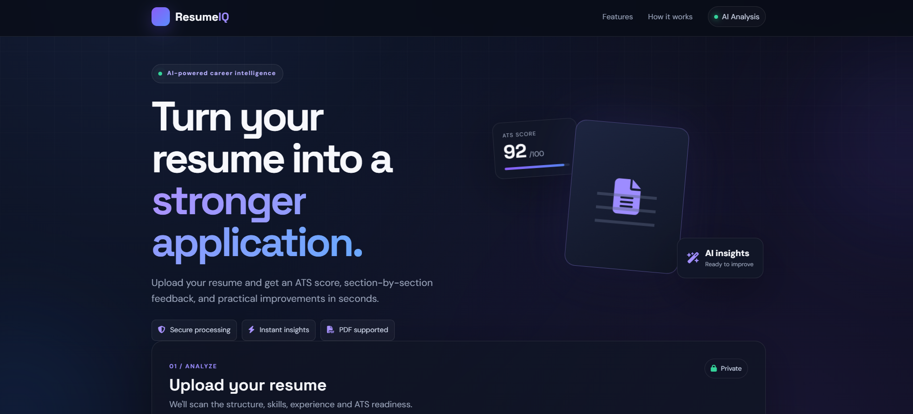
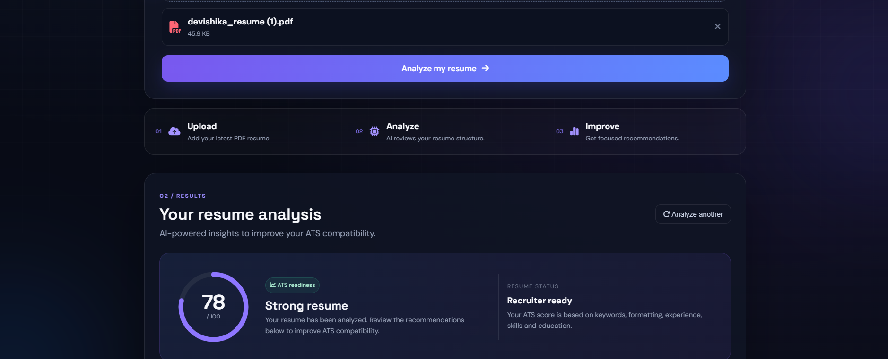
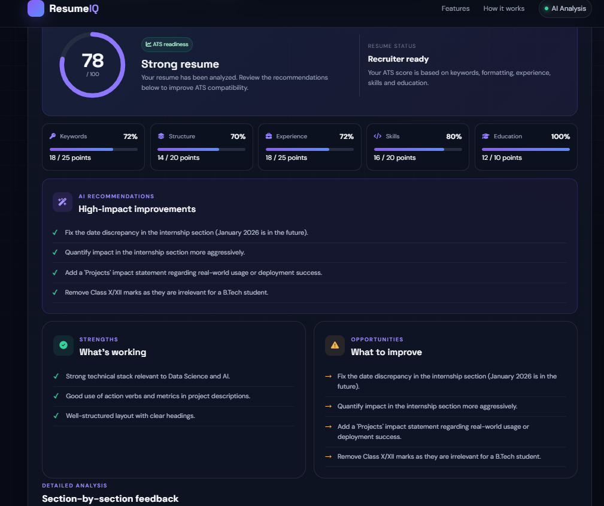

# AI-Powered Resume Analyzer with ATS Scoring


<p align="center">
  
  
  
</p>

## 📸 Project Preview

### Dashboard

<p align="center">
  
</p>

### ATS Score & Analysis

<p align="center">
  
</p>

### AI Recommendations

<p align="center">
  
</p>
# AI-Powered Resume Analyzer with ATS Scoring

A sophisticated web application that uses AI to analyze resumes and provide **ATS (Applicant Tracking System) compatibility scores**, detailed feedback, strengths, and actionable suggestions to help job seekers improve their resumes.

> **⚠️ Note:** The site may take up to **50 seconds** to respond if it has been inactive.

## 🚀 Features

### 🎯 **ATS Compatibility Scoring**

* **ATS Score (0-100):** Get a comprehensive score based on how well your resume performs with Applicant Tracking Systems.
* **Score Breakdown:** Detailed analysis across 5 key criteria:

  * **Keywords (25 pts):** Industry-specific keyword usage and relevance
  * **Formatting (20 pts):** Clean, ATS-parseable layout and structure
  * **Experience (25 pts):** Clear job titles, companies, dates, and achievements
  * **Skills (20 pts):** Relevant technical and soft skills presentation
  * **Education (10 pts):** Clear education details and formatting
* **Visual Dashboard:** Color-coded score display with progress indicators and detailed breakdown.
* **Actionable Improvements:** Specific suggestions to improve ATS compatibility.

### 🤖 **AI-Powered Analysis**

* **Primary AI Analysis:** Uses Google's Gemini API to analyze resumes and generate detailed feedback.
* **Hugging Face Fallback:** Automatically uses Hugging Face when the Gemini request is unavailable or fails.
* **Comprehensive Feedback:** Analyzes multiple resume sections including education, experience, skills, keywords, and formatting.
* **Strengths & Areas for Improvement:** Identifies what is working well and what can be improved.
* **Industry Best Practices:** Provides practical recommendations to improve overall resume quality.

### 🔄 **AI Fallback System**

The application uses a primary-and-fallback AI architecture:

```text
Resume PDF
     ↓
PDF Text Extraction
     ↓
Google Gemini
     ↓
If Gemini fails
     ↓
Hugging Face
     ↓
AI Resume Analysis
     ↓
ATS Score + Feedback
```

This approach improves the reliability of the application by providing a secondary AI provider when the primary provider is unavailable.

### 💻 **User Experience**

* **Modern, Responsive UI:** Clean interface with gradient designs that works across different screen sizes.
* **Real-time Processing:** Resume analysis with loading animations.
* **Visual Feedback:** Clear ATS score and category-wise results.
* **Error Handling:** Appropriate error handling and user feedback.
* **Mobile Optimized:** Responsive design for desktop, tablet, and mobile devices.

---

## 💻 Technologies Used

### **Backend & AI**

* **Python 3.9+:** Core application language
* **Flask 3.0.2:** Web framework
* **Google Gemini API:** Primary AI analysis engine
* **Hugging Face API:** Fallback AI analysis engine
* **PDFMiner:** PDF text extraction
* **python-dotenv:** Environment variable management
* **Gunicorn:** Production WSGI server

### **Frontend & UI**

* **HTML5:** Page structure
* **CSS3:** Styling and responsive design
* **JavaScript ES6+:** Interactive functionality
* **CSS Grid & Flexbox:** Responsive layouts
* **Custom Animations:** Loading and visual interactions

### **Features & Analysis**

* **ATS Scoring System:** 5-category resume evaluation
* **AI Resume Analysis:** AI-generated resume feedback
* **AI Fallback Mechanism:** Gemini → Hugging Face
* **PDF Processing:** Resume text extraction
* **Visual Dashboard:** ATS score and detailed feedback
* **Error Handling:** Robust exception management

### **Deployment & Infrastructure**

* **GitHub:** Version control and source code management
* **Render:** Cloud deployment platform
* **Gunicorn:** Production server
* **Environment Variables:** Secure API key management

---

## 📋 How It Works

### 🔄 **Simple 4-Step Process**

### 1. 📄 Upload Your Resume

* Upload your resume in PDF format.
* The application validates and processes the uploaded file.

### 2. 📑 Extract Resume Content

* PDFMiner extracts text from the uploaded resume.
* The extracted content is prepared for AI analysis.

### 3. 🧠 AI Analysis Engine

* The application first sends the resume data to **Google Gemini**.
* If Gemini is unavailable or the request fails, the application automatically attempts analysis using **Hugging Face**.
* The AI evaluates the resume across multiple dimensions.

### 4. 📊 Comprehensive Results

The application provides:

* **ATS Score:** Overall score from 0-100.
* **Score Breakdown:** Detailed category-wise evaluation.
* **Strengths:** Positive aspects of the resume.
* **Areas for Improvement:** Weaknesses and missing elements.
* **Actionable Recommendations:** Suggestions to improve resume quality and ATS compatibility.

---

## 🔧 Installation & Setup

### Prerequisites

Make sure you have:

* Python 3.9 or higher
* Git
* A Google Gemini API key
* A Hugging Face API token

### Local Development

#### 1. Clone the Repository

```bash
git clone https://github.com/bhardwajdevishika-sys/smart-resume-analyzer.git
cd smart-resume-analyzer
```

#### 2. Create a Virtual Environment

```bash
python -m venv venv
```

#### 3. Activate the Virtual Environment

**For Windows:**

```bash
venv\Scripts\activate
```

**For macOS/Linux:**

```bash
source venv/bin/activate
```

#### 4. Install Dependencies

```bash
python -m pip install -r requirements.txt
```

#### 5. Create Environment Variables

Create a `.env` file in the project root directory:

```env
GEMINI_API_KEY=your_gemini_api_key_here
HF_API_KEY=your_huggingface_api_key_here
```

**Important:** Never upload your `.env` file or API keys to GitHub.

#### 6. Run the Application

```bash
python run.py
```

The application will run locally at:

```text
http://127.0.0.1:5000
```

Open the URL in your browser and upload a PDF resume to test the application.

---

## 🎯 ATS Scoring System

### **What is ATS Compatibility?**

Applicant Tracking Systems (ATS) are software applications used by companies to automatically screen and filter resumes.

This application provides an ATS compatibility score from **0 to 100** and evaluates the resume across five categories.

### **Scoring Criteria Breakdown**

| Category          | Points | What We Analyze                                                      |
| ----------------- | -----: | -------------------------------------------------------------------- |
| 🔑 **Keywords**   | 25/100 | Industry-specific terms, job-relevant vocabulary, and skill mentions |
| 📄 **Formatting** | 20/100 | Clean layout, proper sections, and ATS-parseable structure           |
| 💼 **Experience** | 25/100 | Job titles, companies, dates, responsibilities, and achievements     |
| 🛠️ **Skills**    | 20/100 | Technical skills, soft skills, and relevant competencies             |
| 🎓 **Education**  | 10/100 | Degree information, institutions, and education details              |

### **Score Interpretation**

* 🟢 **80-100:** **Excellent** - Highly ATS-friendly resume
* 🔵 **60-79:** **Good** - Minor improvements recommended
* 🟠 **40-59:** **Fair** - Several improvements needed
* 🔴 **0-39:** **Poor** - Significant improvements required

### **Key Benefits**

✅ **Improve ATS Compatibility:** Identify areas that may affect automated screening.

✅ **Actionable Insights:** Receive specific recommendations for improving the resume.

✅ **Detailed Feedback:** Understand strengths and weaknesses across different resume sections.

✅ **Visual Results:** Easily understand the ATS score and category-wise performance.

---

## 🚀 Deployment

### Deploy to Render

The application can be deployed as a Flask Web Service on Render.

### 1. Push the Project to GitHub

Make sure the latest project version is pushed to your GitHub repository.

### 2. Create a Web Service

Create a new **Web Service** on Render and connect:

```text
https://github.com/bhardwajdevishika-sys/smart-resume-analyzer.git
```

### 3. Configure Build Command

```bash
pip install -r requirements.txt
```

### 4. Configure Start Command

```bash
gunicorn run:app
```

### 5. Add Environment Variables

Add the following environment variables in Render:

```text
GEMINI_API_KEY=your_gemini_api_key
HF_API_KEY=your_huggingface_api_key
```

Do **not** upload the `.env` file to GitHub or manually include API keys in the source code.

---

## 🔍 Project Structure

```text
smart-resume-analyzer/
│
├── app/
│   ├── __init__.py
│   ├── routes.py
│   ├── resume_parser.py
│   │
│   ├── static/
│   │   ├── css/
│   │   │   └── styles.css
│   │   └── js/
│   │       └── scripts.js
│   │
│   └── templates/
│       ├── base.html
│       └── index.html
│
├── .gitignore
├── gunicorn_config.py
├── index.html
├── render.yaml
├── requirements.txt
├── run.py
├── README.md
└── LICENSE
```

### Files excluded from GitHub

```text
.env
venv/
__pycache__/
uploads/
```

These files are excluded using `.gitignore`.

---

## 💡 Future Enhancements

* 🔄 Industry-specific resume analysis
* 🎯 Job description matching
* 📝 Job-specific resume customization
* 📑 Automated PDF report generation
* 👤 User accounts and resume history
* 📈 Resume performance tracking
* 🤖 AI-powered resume optimization
* 🌐 Multi-language resume analysis
* 📊 Resume analytics dashboard

---

## 🙌 Contributing

Contributions are welcome!

If you would like to contribute:

1. Fork the repository
2. Create a new branch
3. Make your changes
4. Commit your changes
5. Create a Pull Request


---
## Features

- Resume parsing and information extraction
- Job description analysis
- ATS-style match score
- Missing keyword identification
- Resume improvement recommendations

## Tech Stack

- **Python** – Core application backend
- **Flask** – Lightweight web framework for handling routes and requests
- **PDFMiner** – Accurate text extraction from uploaded resume PDFs
- **Google Gemini API** – Semantic resume parsing and ATS recommendations
- **HTML / CSS** – Responsive user interface
- 
## 👨‍💻 Author

**Devishika Bhardwaj**

GitHub:
https://github.com/bhardwajdevishika-sys

---

## 🙏 Acknowledgements

* [Google Gemini](https://ai.google.dev/) for AI-powered resume analysis
* [Hugging Face](https://huggingface.co/) for AI inference and fallback support
* [Flask](https://flask.palletsprojects.com/) for the web framework
* [PDFMiner](https://github.com/pdfminer/pdfminer.six) for PDF text extraction
* [Render](https://render.com/) for cloud deployment

---

Made with ❤️ by **Devishika Bhardwaj**

